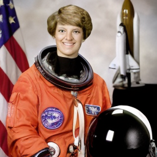
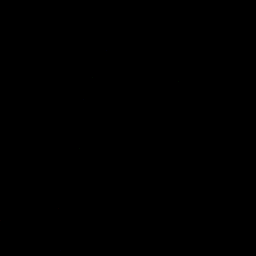
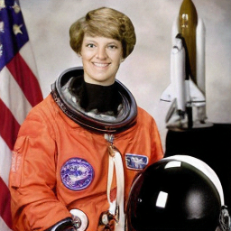
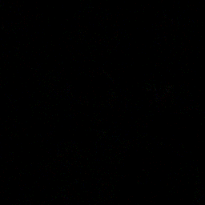
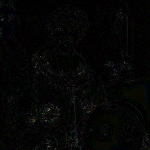
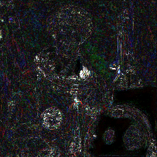

# AutoencoderKL to ONNX to TFLite

This project takes the image model in `models/` and converts it into formats that run on phones. It then proves that the converted versions still produce the same pictures.

The model is a diffusers `AutoencoderKL` with 83.65M parameters: the VAE part of Stable Diffusion. It has two halves:
- **Encoder**: shrinks a 256×256 photo into a small 32×32 "summary" (the latent).
- **Decoder**: turns that summary back into a 256×256 photo.

## Contents

0. [Getting started: clone and download the weights](#getting-started)
1. [Environment](#environment)
2. [Converted models](#converted-models-256x256)
3. [Results: pictures from each method](#results-pictures-from-each-method)
4. [Results: all metrics, including MSE](#results-all-metrics-including-mse)
5. [How to run calibration (full int8)](#how-to-run-calibration-full-int8)
6. [Conversion notes](#conversion-notes)
7. [Mini dictionary](#mini-dictionary)

---

## Getting started

### 1. Clone, including the model files

The `.onnx` and `.tflite` files are stored with **Git LFS** (about 960 MB). Install Git LFS once from https://git-lfs.com, then run:

```
git lfs install
git clone https://github.com/TanmayThaker/sd-vae-mobile.git
```

If you cloned before installing LFS, the model files will be tiny text "pointer" files. Fix that with `git lfs pull` inside the repo.

### 2. Download the PyTorch weights (only needed to rebuild or re-check)

The converted models are already in `artifacts/`. You need the original PyTorch weights **only** to run `convert.py` or `evaluate.py`.
They are not stored here, because anyone can download them from Hugging Face:
**[stabilityai/sd-vae-ft-mse](https://huggingface.co/stabilityai/sd-vae-ft-mse/tree/main)** (MIT license).

Download `diffusion_pytorch_model.safetensors` (335 MB) into the `models/` folder, next to the `config.json` that is already there.
In a browser, click the file on that page, then click "download". Or from a terminal:

```
pip install huggingface_hub
hf download stabilityai/sd-vae-ft-mse diffusion_pytorch_model.safetensors --local-dir models
# older huggingface_hub versions: huggingface-cli download ... (same arguments)
```

To check that you have exactly the file these models were built from, its SHA-256 must be:
`a1d993488569e928462932c8c38a0760b874d166399b14414135bd9c42df5815`

### 3. Set up Python

- **Calibration only, or loading the `.tflite` files:** `pip install -r requirements.txt` (no PyTorch or TensorFlow needed).
- **Rebuilding everything from PyTorch:** `pip install -r requirements-rebuild.txt`, then `pip install --no-deps onnx2tf==2.6.9`.
  Tested with Python 3.12.9 on Windows 11. A CUDA GPU is optional; without one, the scripts use the CPU.

---

## Environment

These are the exact settings on the machine that produced the files in this repo.

The scripts run on the conda `all` env, using its CUDA torch 2.6 and onnxruntime-gpu 1.24. That env lives in
`C:\ProgramData` and is read-only without admin, so the extra packages are installed into an overlay
folder on D: and added via `PYTHONPATH`. The env itself is not modified.

The overlay at `.cache/site_all` holds: onnx 1.20.1, onnxsim 0.6.5, onnx2tf 2.6.9, tensorflow 2.21, tf_keras,
ai-edge-litert 2.2.0, ai-edge-quantizer 0.9.0, and diffusers 0.35.2 (the newest release that works with the env's
huggingface_hub 0.36).

```bash
P=/c/ProgramData/anaconda3/envs/all/python.exe
export PYTHONPATH=$(cygpath -w /d/vijay/.cache/site_all) TF_CPP_MIN_LOG_LEVEL=2
export TMP=$(cygpath -w /d/vijay/.cache/tmp) TEMP=$TMP   # TF conversion writes GBs of temp; C: is nearly full
$P convert.py      # ONNX export + TFLite (fp32, fp16, int8) -> artifacts/onnx, artifacts/tflite
                   # --quant-only rebuilds just fp16/int8 from the existing fp32 .tflite
$P evaluate.py     # parity + accuracy                       -> artifacts/report
```

---

## Converted models (256x256)

| File | Inputs / outputs | Size (encoder / decoder) | Notes |
|---|---|---|---|
| `artifacts/onnx/vae_encoder.onnx` | image `[1,3,256,256]` in [-1,1] → latent `[1,4,32,32]` | 130 MiB | opset 17, simplified |
| `artifacts/onnx/vae_decoder.onnx` | latent `[1,4,32,32]` → image `[1,3,256,256]` | 189 MiB | |
| `artifacts/tflite/*/*_float32.tflite` | `image` [1,256,256,3] / `latent` [1,32,32,4], NHWC | 130 / 189 MiB | Full precision |
| `artifacts/tflite/*/*_float16.tflite` | same, fp32 I/O | 67 / 97 MiB | fp16 weights. **Best starting point for phone apps.** Not yet tested on a device |
| `artifacts/tflite/*/*_int8_weight_only.tflite` | same, fp32 I/O | 33 / 48 MiB | int8 weights, fp32 maths. Same speed as fp32 |
| `artifacts/tflite/*/*_int8_dynamic.tflite` | same, fp32 I/O | 33 / 48 MiB | int8 weights and int8 maths. About 2.7× faster on CPU |
| `*_float16_full.tflite` (not in the repo) | same, **fp16** I/O | 67 / 99 MiB | Pure 16-bit graph, created by `convert.py`. A desktop CPU can't run it, so it is **not verified** and not committed |

**Using them in an app:**
- Images go in and come out as numbers from −1 to 1. Convert with `pixel / 127.5 − 1` on the way in and `(value + 1) × 127.5` on the way out.
- The 0.18215 Stable Diffusion scaling is **not** inside the files. Multiply the encoder output by it before diffusion, and divide by it before decoding.
- The encoder returns the average latent, with no random sampling, so results are repeatable.

---

## Results: pictures from each method

The test picture is the "astronaut" photo, resized to 256×256. It went through **encoder → decoder** on each method, end to end.

The second row shows the difference from the PyTorch result, **amplified 10×** so it can be seen. All black means identical.

| | Original photo | PyTorch GPU (reference) | PyTorch CPU | ONNX Runtime | TFLite fp32 |
|---|---|---|---|---|---|
| **Output** |  |  |  |  |  |
| **Difference ×10** | | (reference) |  |  |  |

| | TFLite fp16 weights | TFLite int8 weight-only | TFLite int8 dynamic |
|---|---|---|---|
| **Output** |  |  |  |
| **Difference ×10** |  |  |  |

What you should see:
- **PyTorch CPU, ONNX, TFLite fp32 and fp16:** the difference images are black. The outputs are identical to the eye.
- **int8 weight-only:** faint outlines only. The output still looks the same.
- **int8 dynamic:** visible noise along edges. Fine detail is slightly softer.

All the pictures are in `artifacts/report/images/`. A single strip with every output side by side is in `artifacts/report/reconstructions.png`.

---

## Results: all metrics, including MSE

The reference is PyTorch on GPU with TF32 off. All numbers come from `artifacts/report/metrics.json`.

### Verdict per method

Quality limits were fixed **before** testing and have not been changed since:

| Precision | Max error relative to largest value (nmax) | Cosine | PSNR vs PyTorch | SSIM vs PyTorch | Allowed PSNR drop vs photo |
|---|---|---|---|---|---|
| fp32 | ≤ 1e-3 | ≥ 0.99999 | ≥ 45 dB | ≥ 0.995 | ≤ 0.1 dB |
| fp16 | ≤ 2e-2 | ≥ 0.9995 | ≥ 35 dB | ≥ 0.98 | ≤ 0.5 dB |
| int8 | ≤ 5e-2 | ≥ 0.999 | ≥ 30 dB | ≥ 0.95 | ≤ 1.0 dB |

| Method | Worst nmax | Worst cosine | PSNR vs PyTorch | SSIM vs PyTorch | PSNR vs photo | Verdict |
|---|---|---|---|---|---|---|
| PyTorch CPU | 1.6e-5 | 1.0000000 | 88.5 dB | 1.00000 | 23.89 dB | ✅ MATCH |
| ONNX Runtime (CUDA) | 8.0e-6 | 1.0000000 | 92.0 dB | 1.00000 | 23.89 dB | ✅ MATCH |
| TFLite fp32 | 3.7e-5 | 1.0000000 | 88.8 dB | 1.00000 | 23.89 dB | ✅ MATCH |
| TFLite fp16 weights | 3.1e-3 | 0.99999994 | 65.3 dB | 0.99994 | 23.89 dB | ✅ MATCH |
| TFLite int8 weight-only | **9.3e-2** | 0.99993 | 49.4 dB | 0.99599 | 23.87 dB | ⚠️ MISMATCH (strict nmax only) |
| TFLite int8 dynamic | **3.97e-1** | **0.9973** | 34.9 dB | 0.96266 | 23.76 dB | ⚠️ MISMATCH |

### Image MSE: final picture after encoder → decoder

MSE is the average squared difference per pixel. **Lower is better, and 0 means identical.** It is shown on two scales:
- **0–255**: normal pixel values.
- **0–1**: pixels divided by 255, which is the 0–255 number ÷ 65025.

| Method | MSE vs PyTorch output (0–255) | MSE vs PyTorch output (0–1) | MSE vs original photo (0–255) | MSE vs original photo (0–1) |
|---|---|---|---|---|
| PyTorch GPU (reference) | — | — | 265.49 | 4.083e-3 |
| PyTorch CPU | 9.155e-5 | 1.408e-9 | 265.49 | 4.083e-3 |
| ONNX Runtime | 4.069e-5 | 6.258e-10 | 265.49 | 4.083e-3 |
| TFLite fp32 | 8.647e-5 | 1.330e-9 | 265.49 | 4.083e-3 |
| TFLite fp16 weights | 1.940e-2 | 2.984e-7 | 265.48 | 4.083e-3 |
| TFLite int8 weight-only | 7.475e-1 | 1.150e-5 | 266.57 | 4.099e-3 |
| TFLite int8 dynamic | 21.05 | 3.238e-4 | 273.48 | 4.206e-3 |

Reading the table:
- **"vs PyTorch output"** measures only what the conversion changed. fp32 and ONNX are at the level of rounding noise.
- **"vs original photo"** includes the VAE's own loss. 265.49 (23.89 dB) is the best this model can do at 256 px, because it always loses some fine detail.
  Every converted version is compared against that number, not against perfection.

### Tensor MSE: raw graph outputs in the parity test

Each graph was fed identical inputs: one random tensor and one real image or latent. These values are in the model's own units, not pixels:
- The **encoder** output (latent) spans about ±20, so its MSE values are bigger.
- The **decoder** output is in [−1, 1].

| Method | Encoder, random input | Encoder, real image | Decoder, random input | Decoder, real latent |
|---|---|---|---|---|
| PyTorch CPU | 4.91e-11 | 5.73e-11 | 1.10e-12 | 6.17e-13 |
| ONNX Runtime | 1.55e-11 | 1.85e-11 | 1.42e-13 | 8.41e-14 |
| TFLite fp32 | 2.15e-10 | 1.52e-10 | 1.14e-12 | 6.60e-13 |
| TFLite fp16 weights | 1.10e-6 | 3.64e-6 | 5.04e-8 | 4.25e-8 |
| TFLite int8 weight-only | 2.36e-3 | 1.70e-3 | 4.50e-5 | 2.10e-5 |
| TFLite int8 dynamic | 2.38e-2 | 1.30e-1 | 4.32e-4 | 8.18e-4 |

### int8 notes

- **Weight-only int8:** passes cosine and every image check. The difference is not visible. It fails only the strict per-element nmax limit,
  on 2 of 4 parity tensors (decoder/real 9.3e-2, encoder/random 8.1e-2). The errors sit at sharp edges.
- **Dynamic int8:** fails parity on every tensor, but the image still passes the int8 limits. It is about 2.7× faster on CPU and gives slightly softer detail.
- The usual fix for both is mixed precision: keep the most sensitive layers (first/last conv, quant convs, attention) in fp16 and leave the rest int8.

Desktop CPU speeds are also in `metrics.json`. They are **not** phone speeds.

---

## How to run calibration (full int8)

### What calibration is

The int8 files above make only the **weights** int8 (and "dynamic" also measures activations live on every run).
A **full int8** model also stores the in-between numbers (the **activations**) as int8. To do that, it must know ahead of time how big those numbers get.

**Calibration** finds out: you show the model a set of example pictures, and it records the range of every layer.
It's like setting a camera's exposure before taking photos. Full int8 is what NPUs, DSPs and Edge TPUs need, and it is the fastest option on them.

> ⚠️ **Known issue.** The last calibration run (14 sample images, 8-bit and 16-bit activations) built all four files.
> The 8-bit-activation encoder then crashed on its first test:
> `tflite/kernels/div.cc:262 data[i] != zero_point ... Node number 9 (DIV) failed to invoke`.
> The normalisation layer's divide step rounds to zero in int8. That run produced no quality numbers, and the 16-bit-activation models were never tested.
> Planned fix: keep the normalisation layers in 16-bit and recalibrate. **Until then, treat calibrated (static) int8 as not working.**

### Step 1: Open a terminal in the project folder

On Windows, open the project folder (the cloned `sd-vae-mobile` folder) in File Explorer, click the address bar, type `cmd` and press Enter.

### Step 2: Switch on the Python environment

**Option A: the conda `all` env (original build machine only)**
```
set PYTHONPATH=D:\vijay\.cache\site_all
set TMP=D:\vijay\.cache\tmp
set TEMP=D:\vijay\.cache\tmp
set P=C:\ProgramData\anaconda3\envs\all\python.exe
```
Then use `%P%` wherever the steps below say `python`.

**Option B: a fresh environment on any computer (one-time setup)**
Install Python 3.12 from https://www.python.org/downloads/. On Windows, tick "Add python.exe to PATH". Then run:
```
python -m venv .venv
.venv\Scripts\activate
pip install -r requirements.txt
```
(On Mac/Linux, use `python3` and `source .venv/bin/activate`.) This downloads about 200 MB. Next time, only the `activate` line is needed.

### Step 3: Collect calibration pictures

1. Make a folder, for example `my_pictures`.
2. Copy in pictures that **look like what the app will really see**. At least 10; 50–200 is ideal.
3. Formats: `.jpg`, `.jpeg`, `.png`, `.bmp`, `.webp`. Any size; the tool crops and resizes them to 256×256 itself.
4. **Do not** include the test picture (step 4). Otherwise the check is not honest.

For a first try, `sample_images/calibration/` already has 14 example pictures.

### Step 4: Run it

```
python calibrate.py --images my_pictures
```

To try it with the samples:
```
python calibrate.py --images sample_images/calibration
```

The tool runs four stages:
1. Reads the pictures, plus 2 extra random crops of each.
2. Runs them through the fp32 encoder and decoder and records each layer's range (the calibration).
3. Builds the int8 models.
4. Checks them on `sample_images/test/astronaut.png` against the fp32 model, then prints MATCH or MISMATCH, with PSNR, SSIM and MSE (both 0–255 and 0–1).

It takes about 25–30 minutes and needs about 8 GB of free RAM.

### Step 5: Find the results

Everything goes into `calibrated_models/`:

| File | What it is |
|---|---|
| `vae_encoder_int8_static.tflite`, `vae_decoder_int8_static.tflite` | Full int8 (8-bit activations) |
| `vae_encoder_int8x16_static.tflite`, `vae_decoder_int8x16_static.tflite` | int8 weights with 16-bit activations (better quality) |
| `calibration_report.json` | All numbers, including MSE |
| `calibration_check.png` | Pictures side by side: original, fp32, int8, int8x16 |

### Step 6: Another round of calibration

Give every round its own output folder, so earlier results are kept:
```
python calibrate.py --images my_pictures_v2 --out calibrated_round2
```
Then compare the printed verdicts and `calibration_check.png` between rounds, and keep the best one.

### Options

| Option | Default | What it does |
|---|---|---|
| `--images FOLDER` | (required) | Calibration pictures; subfolders are included |
| `--test-image FILE` | `sample_images/test/astronaut.png` | Picture used only for the check |
| `--out FOLDER` | `calibrated_models` | Where results go |
| `--activations 8` / `16` / `8 16` | `8 16` | Which versions to build. One value halves the run time |
| `--crops N` | `2` | Extra random crops per picture |
| `--seed N` | `0` | Changes which random crops are taken |
| `--models FOLDER` | auto (`artifacts/tflite`) | Where the fp32 `.tflite` files are |

### If it says MISMATCH

1. Open `calibration_check.png`. If you can't see a difference, it may be good enough.
2. Use the 16-bit-activation version (`_int8x16_static`). It is usually much closer to fp32.
3. Add more pictures that really look like the app's pictures.
4. If the target chip doesn't need full int8, use `_float16` or `_int8_weight_only` instead. Neither needs calibration.

---

## Conversion notes

- The legacy diffusers 0.4.2 attention keys (`query/key/value/proj_attn`) were remapped. The remapped weights were checked tensor-by-tensor,
  and there were no missing or unexpected keys. The `.bin` and `.safetensors` files are identical.
- The onnx2tf `tf_converter` backend miscompiles the mid-block attention: the layout of the Reshape/Transpose after NCHW→NHWC comes out wrong.
  This was isolated per block. GroupNorm, ResBlock, downsample and upsample were all exact, while attention alone had cos 0.977.
  The whole VAE ended up at cos 0.86–0.98, and the image lost about 3 dB PSNR. The default `flatbuffer_direct` backend converts it exactly, so that is what this pipeline uses.
- fp16 and int8 files are made from the verified fp32 TFLite using Google's ai-edge-quantizer.
- Proxy check for 16-bit maths (phone GPU, `_float16_full`): PyTorch `vae.half()` on CUDA gives no NaN/inf, a peak activation of 3024
  (fp16 max is 65504) and an unchanged 23.89 dB. This only covers 256 px; larger sizes need rechecking.
- Nothing has been run on a real phone yet.

---

## Mini dictionary

| Word | Meaning |
|---|---|
| **ONNX** | Universal model format that many tools can read |
| **TFLite / LiteRT** | Google's model format for Android, iOS and small devices |
| **fp32 / fp16 / int8** | Full precision / half precision / whole numbers from −128 to 127. Each step down halves (or quarters) the size and loses a little accuracy |
| **Weights** | The numbers the model learned, stored in the file |
| **Activations** | The in-between numbers computed while processing a picture |
| **Calibration** | Measuring activation ranges with example pictures, so full int8 doesn't clip them |
| **MSE** | Average squared pixel difference. 0 means identical |
| **PSNR** | Closeness in dB. Higher is better; above about 40 dB the difference is invisible |
| **SSIM** | Similarity from 0 to 1. 1 means identical to the eye |
| **Cosine** | How closely two outputs point the same way. 1 means identical |
| **nmax** | Largest single error divided by the largest value. The strictest check |
| **MATCH / MISMATCH** | Whether a method passed **all** pre-set limits |
